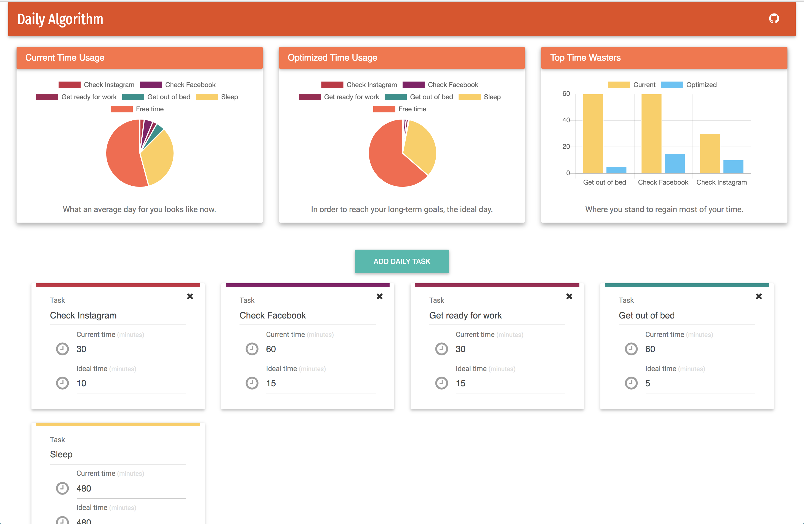
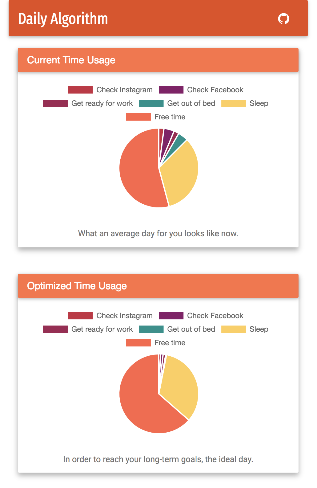

# The Daily Algorithm

An algorithm is a set of steps to accomplish a task or solve a problem. Algorithms are all around us, however something we don't give enough attention to are the algorithms that propel us forward in our daily lives. 

The Daily Algorithm is comprised of the habits and routines that make up an average day for us. To be clear, it's not about every single task that you carry out every day. It's the collection of tasks and steps you're guaranteed to take every day without thinking. They are the habits that shape your character and propel you toward long-term goals.

## Why Should I Care? (5 min)

- We're often times flying by the seat of our pants. A lot of our habits have been formed without much thought. 
- Habits are the foundation for our character. It's not one moment that will make you great, it's the sum of everything you've done that matters.
- To reach our long-term goals, it's rarely ever just "let me work for a few days" and then it suddenly happens. Long-term goals require advances through long periods of time, and you need to prepare for defining moments through repetition and small steps forward.
- When you don't have something that you "have to do", what you end up is wasting time on debating whether you should do it or not. Decide up front what you "have to do" vs what's "nice to do".

> I spent 5 minutes thinking about whether to do a 7 minute workout or not.

## Your Daily Algorithm (15 min)

Before we can optimize our Daily Algorithm, we have to first understand what it currently is. 

Think through a typical day from the perspective of a 3rd party. What are the tasks you're guaranteed to spend time on any given day? Don't get bogged down with uncommon tasks or the weekend. Focus on the tasks that you repeat over and over throughout the week. Write down your thoughts somewhere, like on paper, a text editor, [Trello](https://trello.com/), etc. 

- I recommend not sharing it at first because it's easier to be brutally honest when you're the only one seeing it. Be honest with how you spend your time. 
- Often times, we think about the time we spend in terms of what it "should" or "ideally" be. Reflect though and think about how much time you **actually** spend on them. 
- Let's focus on general activities and not individual steps for those activities. For example, say "Brushing teeth" and not breaking down the actual steps for brushing your teeth.

Here's an example of some generic tasks for a given day: 

| Task | Time Spent |
| --- | --- |
| Sleep | 9 hours |
| Get out of bed | 1 hour |
| Get ready for work | 30 minutes |
| Travel to work | 45 minutes |
| Work | 8 hours |
| Check Facebook | 1 hour |
| Check Instagram | 30 minutes |
| Lunch | 1 hour |
| Travel from work | 45 minutes |
| TV | 2 hours |
| Dinner | 1 hour |
| Shower | 30 minutes |

## Optimize! (15 min)

Time for the fun part. Let's optimize our day and feel good about how we're living going forward.

### Let's Do Better 

Add in the ideal or expected time for each task now. 

Be honest and realistic with the improved time. Some tasks are a set amount of time, for example don't suddenly turn an 8 hour work day into 7 for the sake of optimization. It's perfectly reasonable though if you're working a lot of overtime and going from a 12 hour work day to 10 hour work day.  

### Work Toward Long-Term Goals

Take time to think through the some long-term goals in your life, like staying in touch with friends and family or starting that business. Start adding tasks that you can do daily to prepare or better your life in those areas. For example, once a day you might reach out to a loved one and connect. You might wish that you read more. In that case, set aside some time to begin your new habit. 

The example below builds upon the previous example for current tasks.

| Task | Time Spent | Ideal Time Spent |
| --- | --- | --- |
| Sleep | 9 hours | 8 hours |
| Get out of bed | 1 hour | 5 minutes |
| Get ready for work | 30 minutes | 15 minutes |
| Travel to work | 45 minutes | 45 minutes |
| Work | 8 hours | 8 hours |
| Check Facebook | 1 hour | 15 minutes |
| Check Instagram | 30 minutes | 10 minutes |
| Lunch | 1 hour | 30 minutes |
| Travel from work | 45 minutes | 45 minutes
| TV | 2 hours | 30 minutes |
| Dinner | 1 hour | 30 minutes |
| Call family | - | 15 minutes |
| Reach out to a friend | - | 15 minutes |
| Shower | 30 minutes | 15 minutes |
| Read | - | 30 minutes |

## Visualize and Revise (15 min)

Try out the [Daily Algorithm website](https://mdang.github.io/daily-algorithm/) that accompanies this document which will help you visualize your day and how you spend it in regards to time.

Enter each of the tasks from the *optimized* day you have planned. The app will instantly help you visualize the amount of free time you have in an average day and understand where you're wasting time that you probably shouldn't be.

 

## License

Daily Algorithm is released under the [MIT License](http://www.opensource.org/licenses/MIT).
